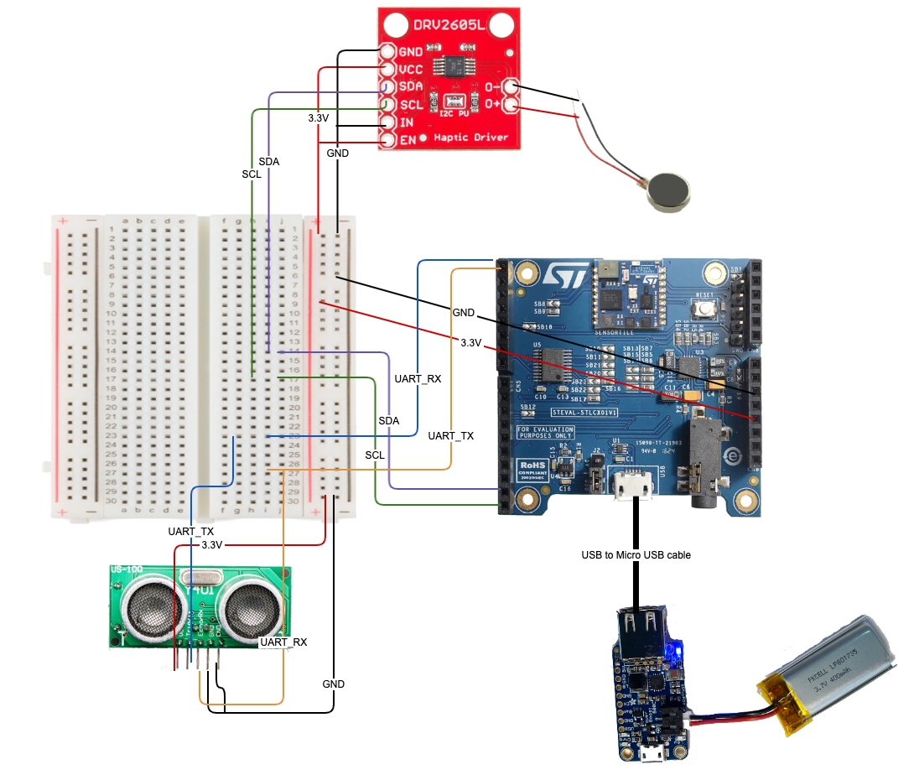

# VISA SensorTile

## Overview
This VISA SensorTile repository is one part of the VISA (Visually Impaired Shopping Assistant) project. It is the wrist worn device that provides haptic feedback to user the wearer to help navigate their hand towards an item on a grocery store shelf. Please see the [final-project-submission repository](https://github.com/DGMD-E-14-FinalProject-Fall2021/final-project-submission) for more details about VISA, specifically the [final project PDF](https://github.com/DGMD-E-14-FinalProject-Fall2021/final-project-submission/blob/main/DMDG%20Final%20Project%20Summary.pdf)

## VISA SensorTile Hardware

At the core of the VISA SensorTile is an Arm Corext-M-4 based STMicroelectronics STM32L476JGY microcontroller on a [STM STEVAL-STLKT01V1](https://www.st.com/en/evaluation-tools/steval-stlkt01v1.html#st_all-features_sec-nav-tab) development kit. This development board features a variety of sensors that work in conjunction with such as an accelerometer, BLE module, 3D linear digital acceleration sensor, 3D digital magnetic sensor and more (see documentation on STEVAL-STLKT01V1).

The SensorTile evluation board is connected to a [DRV2605L Haptic Motor Driver](https://www.sparkfun.com/products/14538) which drives a [vibration motor](https://www.sparkfun.com/products/8449) to give the user feedback. I wrote a library for STM32 based MCU's to interface with the DRV2605L which can be found [here](https://github.com/DGMD-E-14-FinalProject-Fall2021/stm32-drv2605l-library). This library is implemented in this repository.

The SensorTile evaluation board is also connected to a [US-100 Ultrasonic Distance Sensor](https://www.adafruit.com/product/4019) which is able to give feedback to the SensorTile on the distance a wearer's hand is from an object. I wrote a library for STM32 based MCU's to interface with the US-100 which can be found [here](https://github.com/DGMD-E-14-FinalProject-Fall2021/stm32-drv2605l-library). This library is implemented in this repository.

An [Adafruit PowerBoost 1000 DC/DC boost converter](https://www.adafruit.com/product/2465) is used to convert a 3.7V LiPoly battery input into the necessary 5.2V output for the SensorTile evluation board.

Below you will see a diagram of the hardware laid out in a prototyping format.

## See it in action!
You can view the pull demonstration video of the VISA SensorTile **[here on YouTube](https://youtu.be/FO-NtSXTth4)**
). In this video you can see the final hardware wrist worn product.

## Repository Contents
---
- **/visa_sensortile** - VISA SensorTile project folder.
- **/datasheets** - Datasheets for all hardware utilized in VISA SensorTile
- **VISA SensorTile tutorial.pdf/.docx** - Tutorial on how to setup hardware and project. Directions on how to interact with it over bluetooth low energy.

## SensorTile Mac Address
---
The MAC address of the SensorTile is a random static address of C0:CC:BB:AA:AA:AA.

## BLE API
---

***Distance data characteristic value handle*** 
UUID: 00140000-0001-11e1-ac36-0002a5d5c51b 
Characteristic Handle: 000E 
Characteristic Value: Timestamp (2 bytes), pressure (4 bytes), distance (2 bytes) 
Characteristic Value Format: Little endian 

***Client characteristic configuration handle for distance data transmission.*** 
UUID: 00002902-0000-1000-8000-00805f9b34fb 
Characteristic Handle: 000F 

| Value       | Result      |
| ------------- | ------------- |
| 0100          | Turns on distance data transmission  |
| 0000  | Turns off distance data transmission  |

***Client characteristic configuration handle for haptic feedback.*** 
UUID: 20000000-0001-11e1-ac36-0002a5d5c51b 
Characteristic Handle: 0011 

| Value       | Result      |
| ------------- | ------------- |
| 0000          | Turns off haptic feedback  |
| 0100  | Turns on vibration pattern to navigate hand right  |
| 0200  | Turns on vibration pattern to navigate hand left  |
| 0300  | Turns on vibration pattern to navigate hand up  |
| 0400  | Turns on vibration pattern to navigate hand down  |
| 0500  | Turns on vibration pattern to navigate hand forward  |
| 0600  | Turns on vibration pattern to navigate hand backward  |
